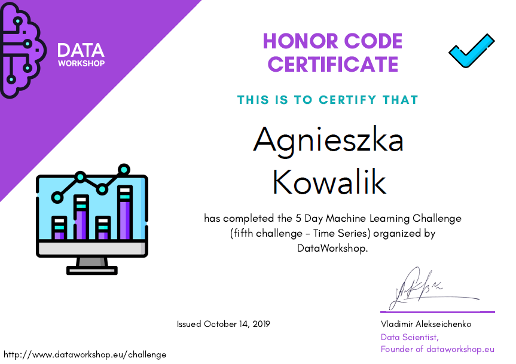
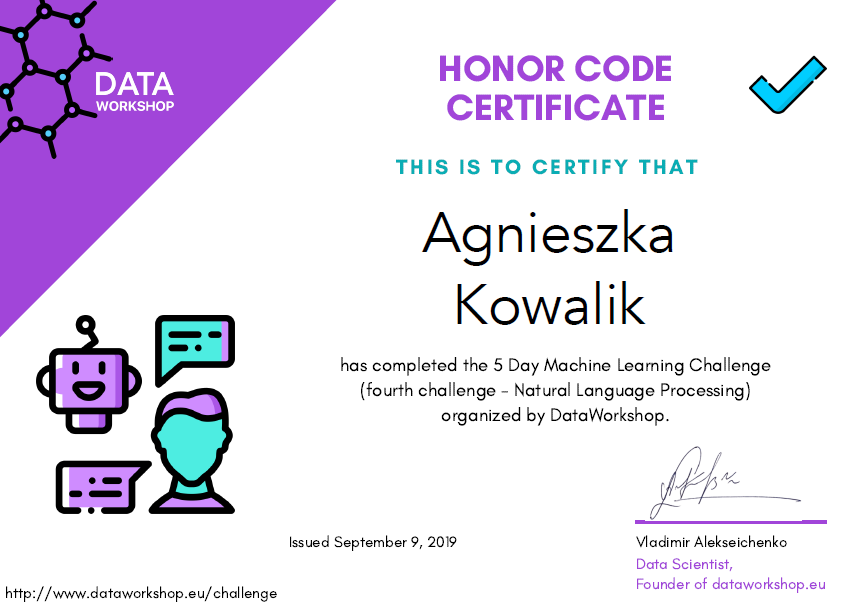
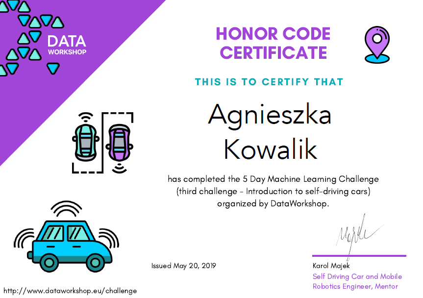
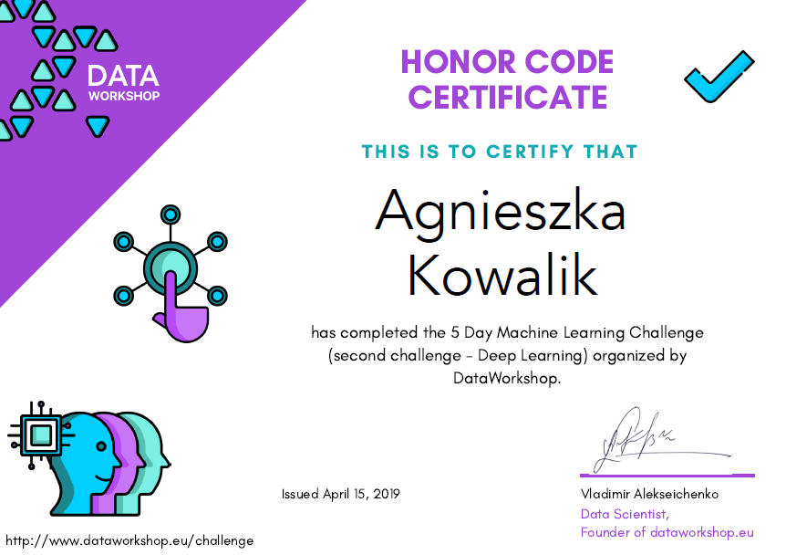
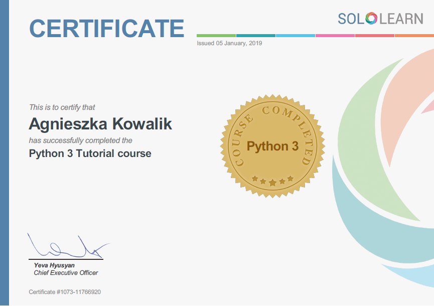
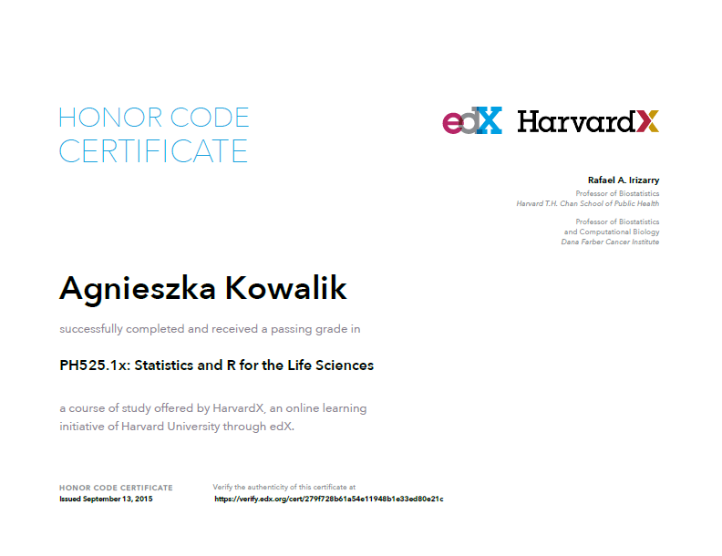
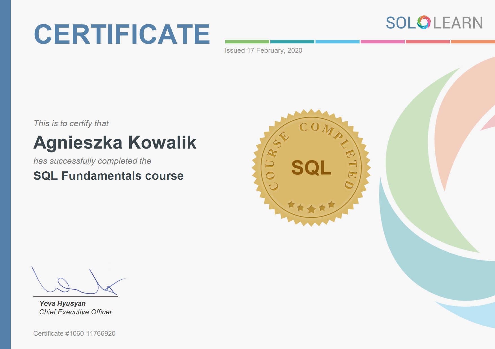
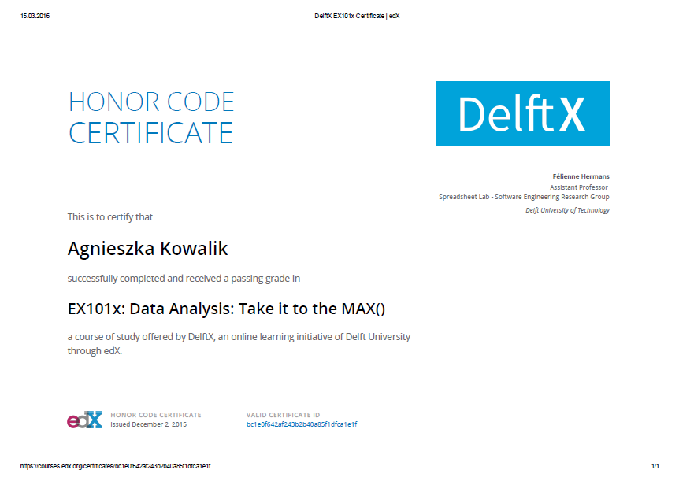

# Certificates

#### Python
* **Time Series** 
* **Natural Language Processing** 
* **Introduction to self-driving cars** 
* **Deep Learning** 
* **Python 3 Tutorial** (SoloLearn)

#### Inne
* **Statistics and R for the Life Sciences** (edX)
* **CSS Fundamentals** (SoloLearn)
* **HTML Fundamentals** (SoloLearn)
* **SQL Fundamentals** (SoloLearn)
* **Data Analysis: Take it to the MAX()** (edX)
#

